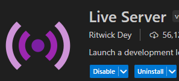
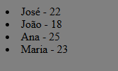

## OBS: Precisa ter um o o Live Server intalado no VSCode 



# Exemplo de Arquivo `dados.json`

Para que o código funcione corretamente, crie um arquivo `dados.json` no mesmo diretório do arquivo HTML. O conteúdo do arquivo `dados.json` pode ser algo como:

```json
{
    "usuarios": [
        {
            "nome": "João",
      "idade": 25
    },
    {
        "nome": "Maria",
      "idade": 30
    },
    {
        "nome": "Carlos",
      "idade": 22
    }
  ]
}

```
<br />

# No navegador: 

# acessando_json_com_js
Acessando json com JS

# Acessando Dados de um Arquivo JSON com JavaScript

Este projeto demonstra como acessar e exibir dados de um arquivo JSON na página web utilizando HTML e JavaScript. O código faz uso da API `fetch()` para ler o conteúdo do arquivo `dados.json` e mostrar as informações em uma lista na página.

## Como funciona o código

- O arquivo HTML possui um elemento `div` com o id `usuarios`, que é onde os dados serão exibidos.
- O código JavaScript realiza as seguintes ações:
  - Utiliza o método `fetch()` para carregar o arquivo JSON chamado `dados.json`.
  - Quando a resposta é recebida, o conteúdo JSON é convertido em um objeto JavaScript.
  - O código acessa a lista de usuários dentro do objeto JSON e itera sobre ela com o método `map()`.
  - Para cada usuário, o nome e a idade são exibidos em um item de lista (`<li>`), que é adicionado ao `divUsuarios`.

## Requisitos

Para que o código funcione corretamente, é necessário ter um servidor local ativo, pois o método `fetch()` não consegue acessar arquivos locais diretamente em muitos navegadores devido a questões de segurança. Isso significa que o arquivo `dados.json` deve ser servido por um servidor local.

### Instalar o Live Server no VSCode

Para rodar o projeto localmente, siga os seguintes passos:

1. **Instalar o Live Server no VSCode**:
   - Abra o Visual Studio Code.
   - Vá até a aba de extensões (ícone de quadrado no menu lateral ou pressione `Ctrl+Shift+X`).
   - Pesquise por **"Live Server"**.
   - Clique em **"Install"** para instalar a extensão.

2. **Rodar o Live Server**:
   - Abra o arquivo HTML no VSCode.
   - Clique com o botão direito no arquivo e selecione **"Open with Live Server"**.
   - O Live Server irá iniciar um servidor local e abrirá a página no navegador.

3. **Estrutura do Projeto**:
   - O código HTML deve estar na raiz do seu projeto.
   - O arquivo `dados.json` deve estar no mesmo diretório que o arquivo HTML ou em um caminho relativo correto.
